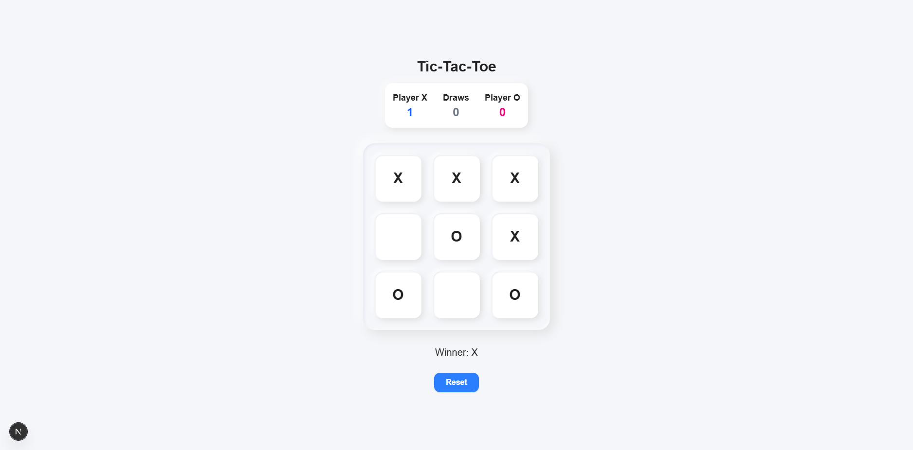

# Tic-Tac-Toe Game

A modern Tic-Tac-Toe game built with [Next.js](https://nextjs.org/) and [Tailwind CSS](https://tailwindcss.com/), featuring a beautiful neomorphic design and a live scoreboard for Player X, Player O, and draws.



## Features

- Play classic Tic-Tac-Toe in your browser
- Live scoreboard for Player X, Player O, and total draws
- Responsive, mobile-friendly, and modern UI
- Neomorphism effect for the board and controls
- Built with Next.js App Router and Tailwind CSS

## Getting Started

1. **Clone the repository:**
   ```bash
   git clone https://github.com/jamesdiamla27/tic-tac-toe.git
   cd tic-tac-toe
   ```
2. **Install dependencies:**
   ```bash
   npm install
   # or
   yarn install
   ```
3. **Run the development server:**
   ```bash
   npm run dev
   # or
   yarn dev
   ```
4. Open [**Tic-Tac-Toe**](https://tic-tac-toe-diamla.vercel.app) in your browser to play.

## How to Play
- Click any empty cell to place your mark (X or O).
- The game automatically tracks whose turn it is.
- The scoreboard updates for wins and draws after each round.
- Click the **Reset** button to start a new round (scores persist until page reload).

## Customization
- The favicon and logo can be changed by replacing `public/logo.png`.
- The board and UI use a light neomorphic theme by default.

## License

This project is open source and available under the [MIT License](LICENSE).
